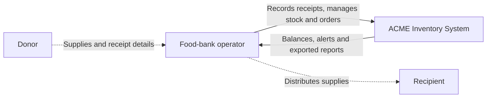
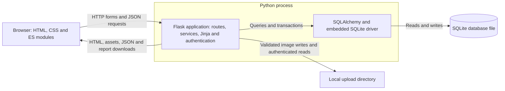
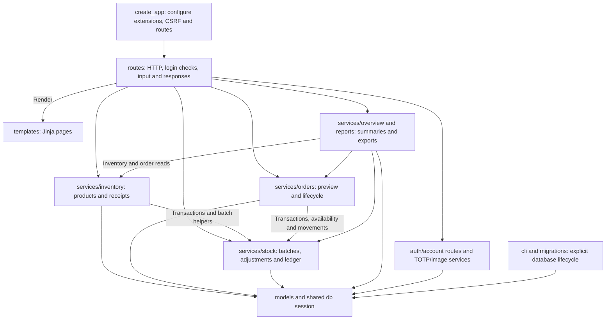
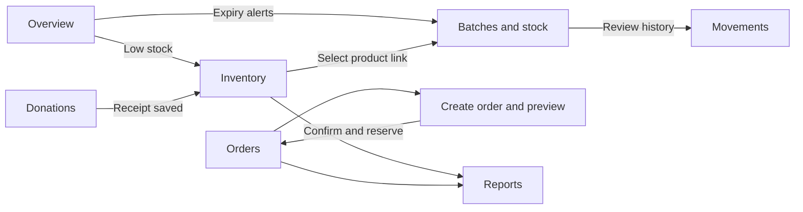

# Architecture and naming

[Developer guide](developer-guide.md) · [Documentation index](../README.md#documentation)

The application is a modular Flask monolith. `create_app` loads configuration,
binds shared extensions, and registers routes and CLI commands. Importing the
package does not create database tables or start a server.

Request flow: route → service → model/database. Routes handle HTTP input and access
checks. Services validate business rules and own commit/rollback boundaries.
Models describe persisted data and serialization; they do not commit transactions.
Stock mutations acquire a SQLite writer lock before reading balances. Batch
changes, reservations, normalized order lines and movement history commit together.
The services/stock.py module owns shared stock summaries and transaction helpers.
Versioned schema and data upgrades live in migrations.py.

Python files/functions/fields use snake_case, classes use PascalCase, constants
use UPPER_SNAKE_CASE. JavaScript functions use camelCase and CSS uses kebab-case.
Dates use `_on`, timestamps use `_at`; API fields match model vocabulary.

Templates are organized by feature. `base.html` loads common CSS, while each page
loads its own ES module. Request, notification, search and sorting helpers live
under `static/js/common`. Navigation is rendered by Jinja; user content is escaped
by templates or inserted using DOM textContent rather than HTML concatenation.

Default images are versioned in static/images. User uploads use UPLOAD_DIR and an
authenticated serving route; databases/secrets live outside the application package.
There is no frontend build step or external CDN dependency.

Do not create empty services, migration directories, or repository abstractions
before they have a concrete responsibility. Add domain modules as features grow.

## Interface

The workspace uses a persistent desktop sidebar and a compact mobile navigation
 grid, a shared page header, reusable metric cards, and consistent forms and tables.
The authenticated overview shows real product counts, batch expiration alerts, category
mix, and recent orders; the public home page does not expose inventory information.

Inventory filters combine product search, category, and stock status. “Expiring
soon” means stock on hand with an expiration date from today through seven days
from today, inclusive. “Expired” excludes products with zero quantity. “In stock”
in the inventory filter means positive eligible unreserved stock. Physical on-hand
and reserved amounts are shown separately. Status is communicated with text as well as color. Overview cards link to
corresponding inventory filters. No sample records are added to the user's database.

Shared colors and layout live in static/css/base.css; components and responsive
rules live in static/css/components.css. Inline SVG icons are defined in the Jinja
icons macro, with no external icon or font dependency. Forms retain visible labels,
keyboard focus states, and a skip-to-content link. Wide tables scroll within their
own container on small screens.

## System context

Current scope. Solid arrows show application use; dotted arrows show physical
business interactions outside the software boundary. Donors and recipients have
no dedicated login or external API integration.

## Runtime architecture

A C4-style overview of current running parts. Browser JavaScript is served by Flask;
there is no separately deployed frontend server. SQLite is an embedded database
file, not a database service listening on a network port.

## Application modules

Solid arrows below mean calls or rendering/data access, not network boundaries.
All modules run inside the same application. Shared extensions provide database,
password hashing and login integration.

This is a responsibility map, not an exhaustive Python import graph. In particular,
`Item.serialize()` delegates calculated balances to `stock_summary`; authentication
routes also access user models directly. The factory creates the instance directory
and may create a local signing secret, but database initialization is an explicit CLI
operation. See [developer code map](developer-guide.md#where-to-change-a-feature).

## Page navigation

These are the operator's main entry points, not distinct services.

For exact URLs and authentication requirements, see [development notes](development.md).
