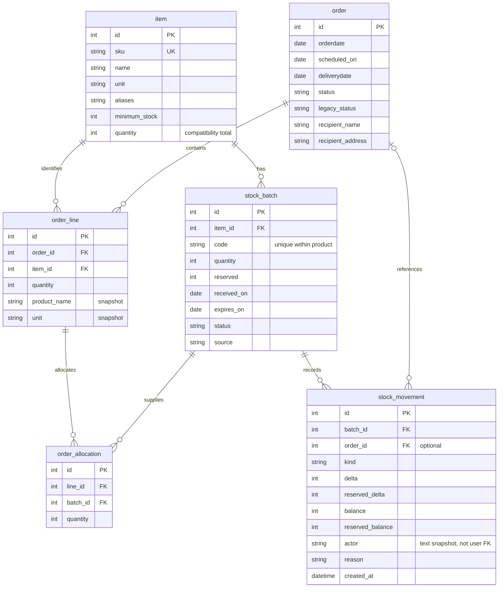

# Inventory data model

[Developer guide](developer-guide.md) · [Documentation index](../README.md#documentation)

The application retains the original `user`, `item`, and `order` tables and adds
normalized business tables through the versioned SQLite migration in migrations.py.

| Table | Responsibility |
| --- | --- |
| item | Product identity: unique uppercase SKU, name, aliases, category, fixed base unit, minimum stock |
| stock_batch | One receipt lot: product, batch code, source, receipt/expiry dates, on-hand, reserved, Available/Quarantined status |
| order | Recipient, order/scheduled/delivery dates, Reserved/Cancelled/Fulfilled status |
| order_line | Product reference, quantity and historical name/unit snapshot |
| order_allocation | Quantity reserved from each batch for an order line |
| stock_movement | Append-only application ledger: physical/reserved changes, resulting batch balances, reason, operator, order, UTC time |
| operation | Successful request keys and payload fingerprints for duplicate-write protection |
| schema_version | Completed schema/data migrations |

`stock_batch` is authoritative for inventory. The legacy `item.quantity` is a
transactionally maintained on-hand total; its old dates summarize remaining batches
for compatibility and must not be edited as product fields. `order.items` remains a
legacy export representation; new operations use order_line and order_allocation.

All quantities are integers in a product's base unit. Units cannot change after a
batch exists. Available stock equals on-hand minus reserved, restricted to batches
already received, not quarantined, and not expired on the requested distribution
date (never earlier than today). Expiry is inclusive: stock expiring today is valid
today. Low stock means available is strictly less than the configured minimum.

A product's batch code is unique within that product. Batch constraints enforce
0 <= reserved <= quantity. Products with batch or order history cannot be deleted.
All stock mutations use a SQLite writer transaction acquired before reading balances;
reservation, fulfillment, cancellation and ledger records commit or roll back together.
This runtime and migration target SQLite; moving to another database requires a
reviewed locking strategy and migration path.

## Migration and recovery

Stop the server, then run `python -m flask --app acme_inventory upgrade-db`.
Before modifying a populated database, the command creates a SQLite backup named
`inventory.db.before-v1-<timestamp>.bak` alongside it. Schema changes and backfill run
in a single transaction; malformed history fails without partial migration.
Repeated execution does not duplicate balances, lines or movements.

Existing product balances become LEGACY-<id> opening batches. Previous movements
cannot be reconstructed. Existing orders retain their original status in
legacy_status, become read-only Legacy recorded orders, and get normalized lines.
No new reservations or deductions are made for these orders. Actual historical
fulfillment is not inferred from the old Confirmed status.

To restore, stop the server and use SQLite backup from the selected .bak file into
a separate restored database, then point ACME_DATABASE_URL at it and run the matching
older application revision. Keep the current database until recovery is verified.
Backups contain account data and belong in the private instance directory.

## Entity relationships

The diagram uses database table/column names. `order.orderdate` and
`order.deliverydate` map to the Python attributes `ordered_on` and `delivered_on`.
Only identifiers and selected business fields are shown; [model files](../src/acme_inventory/models)
contain the complete definitions. Cardinalities below reflect declared relationships;
services additionally require at least one line for new orders.

`user`, `operation` and `schema_version` are support tables outside this relationship
view. The ledger's `actor` is text, not a foreign key to `user`. `operation.result_id`
is an untyped result reference, not a declared foreign key to one particular table.
Cancelled and fulfilled orders retain their allocation records for history; active
reservations are the balances on batches, not the sum of all historical allocations.

## Balance example

For one product measured in bags, an eligible batch with 10 on hand and 3 reserved
contributes 7 available. Another batch with 5 expired bags contributes 0 available.
The product therefore shows 15 on hand, 3 reserved and 7 available. Summing quantities
across different product units does not produce a meaningful inventory total.

`expired` and `expiring` are date-derived quantities, not stored batch statuses.
Expiry alerts include positive physical stock even if it is reserved or quarantined.
The database check constraint protects batch quantity/reservation bounds; status,
date and lifecycle rules are enforced in application services.
