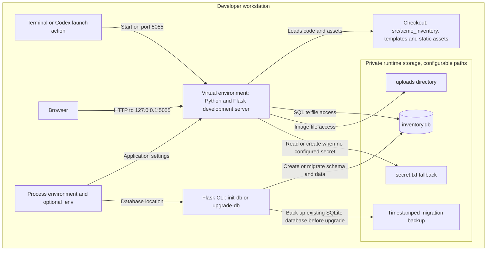

# Development and migration

[System overview](system-overview.md) · [Documentation index](../README.md#documentation)

Install `.[dev]` and run commands from the repository root. Package configuration,
dependencies, pytest and lint settings live in pyproject.toml.

## Run and inspect

Follow [README setup](../README.md#setup) for a fresh checkout. For an existing
database, stop the server and follow [migration and recovery](data-model.md#migration-and-recovery)
before starting this release. With the virtual environment activated:

```powershell
python -m flask --app acme_inventory run --port 5055
```

Open `http://127.0.0.1:5055`. The repository's Codex launch action uses this port;
plain `flask run` defaults to port 5000. Register an account in a fresh database.
There are no repository-shipped account credentials or sample inventory.

For a hands-on walkthrough in a disposable instance: create a product, receive two
batches with different expiry dates, preview an order, confirm it, and fulfill or
cancel it. Compare the on-hand, reserved and available columns, then inspect
Movements. Never use a working business database for destructive experiments.

## Where to change a feature

| Concern | Entry points | Useful regression tests |
| --- | --- | --- |
| Startup, sessions, CSRF | [factory](../src/acme_inventory/__init__.py), [configuration](../src/acme_inventory/config.py) | [authentication](../tests/test_auth.py), [structure](../tests/test_structure.py) |
| Products and receipts | [inventory service](../src/acme_inventory/services/inventory.py), [donation routes](../src/acme_inventory/routes/donations.py) | [inventory](../tests/test_inventory.py) |
| Batches, counts and movement ledger | [stock service](../src/acme_inventory/services/stock.py), [stock routes](../src/acme_inventory/routes/stock.py) | [stock workflows](../tests/test_stock_workflows.py) |
| Preview, reservation and fulfillment | [order service](../src/acme_inventory/services/orders.py), [order routes](../src/acme_inventory/routes/orders.py) | [orders](../tests/test_orders.py), [stock workflows](../tests/test_stock_workflows.py) |
| Dashboard and exports | [overview](../src/acme_inventory/services/overview.py), [reports](../src/acme_inventory/services/reports.py) | [overview tests](../tests/test_overview.py), [report tests](../tests/test_reports.py) |
| Schema and legacy compatibility | [models](../src/acme_inventory/models), [migration](../src/acme_inventory/migrations.py), [CLI](../src/acme_inventory/cli.py) | [legacy import](../tests/test_legacy.py) |
| UI and interaction | [templates](../src/acme_inventory/templates), [page scripts](../src/acme_inventory/static/js/pages), [shared CSS](../src/acme_inventory/static/css) | [page and asset checks](../tests/test_structure.py), browser walkthrough |

A typical feature change touches a route, a service, its template/page script, and
behavioral tests. Put balance rules in services rather than duplicating them in JS.
The browser may preview or filter; the server validates every write again.

## Configuration

Flask CLI loads `.env`; WSGI deployments must supply process environment variables.

| Variable | Meaning |
| --- | --- |
| ACME_INSTANCE_PATH | Absolute runtime directory; defaults to Flask's instance path |
| ACME_DATABASE_URL | Database URL; default is inventory.db in the instance directory |
| ACME_UPLOAD_DIR | Upload directory, separate from image URL paths |
| ACME_SECRET_KEY | Stable secret; local default is generated in instance/secret.txt |
| FLASK_DEBUG | Explicit Flask CLI debug setting |

The old server.ini and certificate placeholders are retired. Use a production
WSGI server and HTTPS reverse proxy for deployment.

## Legacy import

Stop the old app and back up its database/images. Set a fresh ACME_INSTANCE_PATH,
then run `flask --app acme_inventory import-legacy --database <old-db> --images <old-images>`.
Do not run init-db first. The importer refuses an existing destination, uses SQLite
backup, and rewrites image references only in the copy. Omitting --images uses
bundled placeholders. Source files are unchanged. Users sign in again because
the old session secret is not imported; their passwords and TOTP secrets remain.

## HTTP changes

Page URLs remain /, /home, /inventory, /add_donation, /orders, /add_order, /report,
/account, /login_form, and /signup_form. Prototype /item_form, /item_list, /login_test,
and /success are removed. Old JSON APIs are replaced; update external clients:

| Previous | Replacement |
| --- | --- |
| GET /getInventoryData, /search_item | GET /api/items?search=... |
| POST /addItem | POST /api/items |
| POST /updateItem | PUT /api/items/{id} |
| POST /deleteItem | POST /api/items/delete |
| POST /neworder | POST /api/orders |
| GET /getReportData | GET /api/reports?report_type=inventory or orders |
| POST /generateReport | POST /api/reports/export |

The original item and order payloads below are extended by the Batch inventory
release section. Opening stock accepts quantity, received_on and expires_on;
subsequent balance changes require audited batch operations.
Order payload: ordered_on, recipient_name, recipient_address, items (objects with
item_id and quantity). Export payload: report_type and format (`csv` or `xlsx`).
Delete payload: ids list. HTML forms send csrf_token; JSON uses X-CSRF-Token from
the page meta tag. Operational endpoints require login. Logout is now POST.

## Validation

`python -m pytest` runs against temporary data, covering authentication/CSRF,
inventory, order rollback, export, images, page assets, and legacy import.
`python -m ruff check src/acme_inventory tests` checks code quality.
`python -m build` verifies packaging; templates and assets are included in wheels.


## Batch inventory release

New pages: `/stock` and `/movements`. Run `flask --app acme_inventory upgrade-db`
with the server stopped before using this release with an existing database.
`init-db` now uses the same versioned upgrade path; import-legacy upgrades its copy.

| Endpoint | Payload / query |
| --- | --- |
| GET /api/items | search, category, status (available/out/low/expired/expiring), on_date |
| POST /api/items | name, category, optional sku/unit/aliases/minimum_stock; optional opening quantity and dates |
| PUT /api/items/{id} | name, category, sku, unit, aliases, minimum_stock; balance/date edits rejected |
| GET /api/batches | item_id, category, days, expired=1 |
| POST /api/receipts | item_id OR new-product fields; quantity, received_on, expires_on, optional batch_code/source |
| POST /api/batches/{id}/adjust | action=count/dispose/quarantine/release, reason; count uses counted_quantity + expected_quantity; disposal uses quantity |
| GET /api/movements | item_id, kind |
| POST /api/orders/preview | ordered_on, scheduled_on, recipient_name, recipient_address, items [{item_id, quantity}] |
| POST /api/orders | same as preview; creates reservations, not physical deductions |
| GET /api/orders/{id} | Returns status, normalized lines and batch allocations |
| POST /api/orders/{id}/transition | action=cancel/fulfill, reason, optional delivered_on (defaults to today) |

Product creation, receipts, batch adjustments, and order writes accept optional
`request_key`. The UI supplies one for these writes. Successful retries with the
same payload return the existing result; reusing a key with different details fails.
Failed writes do not consume a key. All endpoints use the existing login and CSRF
mechanism. The APIs are application endpoints; no Agent layer is included.

Tests cover expiry boundaries, FEFO allocation, independent lots, reservations,
cancellation, fulfillment, replay protection, concurrent writes, stale physical
counts, protected history, migration re-entry, page assets and all report formats.

## Local deployment

This is the current development environment, not a production deployment claim.
Arrows name protocols or file access. The CLI initialization/migration step is
explicit; starting the server alone does not upgrade tables.



The default paths are resolved from Flask's `app.instance_path`, not hard-coded to
the working directory. In this editable source layout that is normally `src/instance`.
`ACME_DATABASE_URL` and `ACME_UPLOAD_DIR` can override their locations independently.
The signing secret may come from `ACME_SECRET_KEY` instead of a file. Keep actual
credentials and database backups out of Git; `.env.example` documents variable names.

For production, a WSGI server, HTTPS termination, access policy and backup operations
need their own deployment design. No such infrastructure is provisioned here. A
Git revert changes tracked code; it does not reverse database migration or stock
operations. See [data recovery](data-model.md#migration-and-recovery).

## Verifying a development change

Run commands from the repository root with the virtual environment activated:

```powershell
python -m pytest
python -m ruff check src/acme_inventory tests
python -m build
```

Tests use temporary databases through [fixtures](../tests/conftest.py). Use
[stock workflow tests](../tests/test_stock_workflows.py) for inventory invariants,
[order tests](../tests/test_orders.py) for concurrent reservations, and
[legacy tests](../tests/test_legacy.py) for migration compatibility. UI changes also
need a browser walkthrough: asset/HTTP tests do not execute JavaScript interactions.
These are local checks, not a claim of a configured CI/CD deployment pipeline.

For documentation-only changes, verify relative links, Mermaid syntax, model/route
names and diagram semantics against source. Do not run migrations or modify business
data just to preview documentation.


## Implementation notes for stock changes

Stock writes and ledger entries must commit together. Do not update only the
compatibility `Item.quantity` field or bypass stock services. Supported API writes
require clients to supply `request_key` to receive replay protection; see the
[endpoint reference](#batch-inventory-release). FEFO breaks equal-expiry ties by
batch ID. Preserve these details when changing allocation behavior.

## Maintaining the documentation

Update the owning document in the same change as a modified module, relationship,
state transition or deployment assumption. Use meaningful arrow labels and keep
static dependencies separate from runtime sequences. The ER diagram shows declared
relationships; consult models and migrations for full schema details. Add a short
architectural decision record when a substantial tradeoff changes (for example,
replacing SQLite), rather than expanding every diagram.
