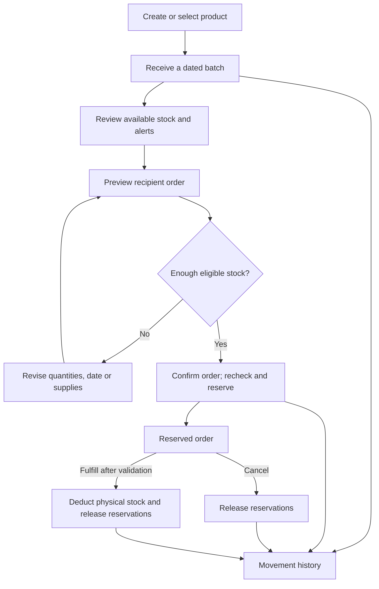
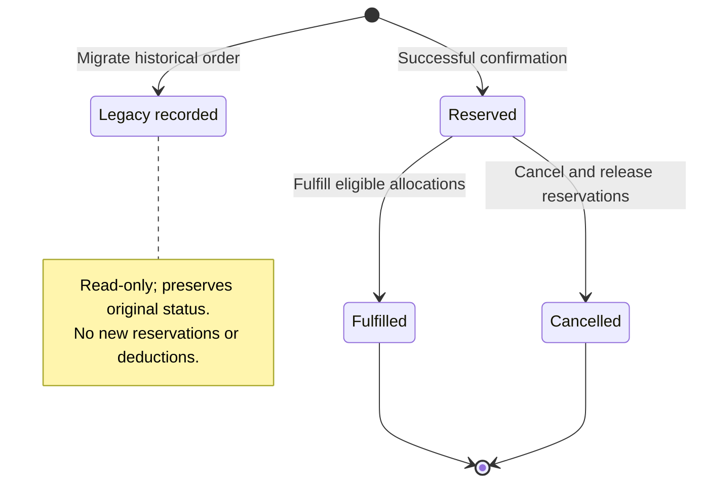

# Business workflows

[Developer guide](developer-guide.md) · [Documentation index](../README.md#documentation)

## Products and units

Inventory -> Add item creates a product with no stock. Set a unique SKU (or let the
system generate one), name, Food/Hygiene category, aliases, base unit and minimum
available stock. Search supports name, SKU, alias and numeric ID. Edit selected changes
product metadata. Product names link to that product's batches. Use a fixed base unit
such as bag or carton; all quantities are whole numbers and are not converted.

## Receipts and batches

Donations -> choose an existing product or define a new one -> enter quantity,
receipt/expiry dates, optional batch code and donor/source -> Receive donation.
Each receipt creates a separate lot. It never overwrites another lot's dates.
Receipt date cannot be future; expiry cannot precede receipt. Expired receipts are
recorded but excluded from available stock. Same-product batch codes cannot repeat.

## Orders

Orders -> Create order -> select products and quantities -> enter recipient,
address, order date and scheduled distribution date -> Check availability.
The preview shows eligible balances, shortages and proposed earliest-expiry-first
batch allocations without changing inventory. Confirmation revalidates the plan.

Confirm & reserve creates normalized order lines and reservations in one transaction.
It leaves physical on-hand balances unchanged and reduces availability. Insufficient
stock for any line rejects the whole order. Duplicate product lines are aggregated.
The scheduled date must be today or later and cannot precede the order date.

A Reserved order has two actions:

- Fulfill: enter actual delivery date and reference/reason. Eligible reserved stock
  is deducted from physical balances, reservations are released, status is Fulfilled.
- Cancel order: enter a reason. Reservations are released without physical deductions;
  status is Cancelled.

Completed/cancelled orders cannot transition again. Fulfillment rechecks expiry and
batch status. If a reserved batch has expired, cancel and recreate the order with
eligible stock. Fulfillment dates cannot be future, before the order, or before
receipt. Historical migrated orders are read-only and never deduct stock again.

## Physical counts and disposal

Batches & stock -> Manage -> select an operation and enter a reason:

- Physical count sets the batch's total on-hand quantity to what was counted.
- Dispose / write off removes the specified quantity and records why.
- Quarantine blocks a batch from new orders; Release quarantine makes it eligible
  again if its dates are valid.

Counts cannot fall below reserved quantities. Disposal cannot consume reserved
stock. Quarantine changes require reservations to be cancelled first. If physical
stock changed since a count form was opened, the count is rejected; reload and count
again. Stock movements lists every physical/reserved change, resulting balance,
operator, reason and associated order. Filter by product or movement type.

## Low-stock and expiration review

Set minimum stock on products. Inventory -> Below minimum stock uses eligible,
unreserved availability. The overview links to low-stock products and expiry alerts.
Batches & stock filters by product, category, quarantine, expired stock, or expiry
within N days (inclusive, maximum 3650). Expiry views exclude zero-quantity batches.
Use quarantine or disposal to record the disposition of problem stock.

## Accounts and reports

Accounts retain registration, login, password changes and optional authenticator 2FA.
All registered users have the same operational access. All writes require CSRF.
Reports offers Inventory, Orders, Stock batches and Stock movements previews and
CSV/XLSX exports. Preview search does not restrict export. Spreadsheet formula
prefixes are escaped; empty reports retain headers.

## Business flow

This diagram describes operator actions. The following sequence diagrams explain
how the application implements the important steps.



## Order states

Preview is a read-only calculation, not a persisted Draft state. The API also
allows direct confirmation without a prior preview. Both entry paths revalidate
availability when creating a reservation.



Errors leave the previous state unchanged. A supported request replay returns the
existing record before attempting a transition; it does not fulfill or cancel again.

## Batch states

```mermaid
stateDiagram-v2
    [*] --> Available: Receive batch
    Available --> Quarantined: Quarantine with reason; no reservations
    Quarantined --> Available: Release with reason; no reservations
    note right of Available
        Eligibility also depends on dates.
        Expired and empty are derived conditions.
    end note
```



Physical counts and disposal change quantities, not the stored status. Empty batches
remain for history. Releasing quarantine cannot make an expired batch available for
orders. Counts/disposal and both status changes write movement records.

## Confirm an order

Source: [order routes](../src/acme_inventory/routes/orders.py),
[create_order and build_plan](../src/acme_inventory/services/orders.py), and
[atomic and operation](../src/acme_inventory/services/stock.py).
The diagram assumes a new request key; an identical successful replay short-circuits
with the stored result ID. A reused key with a different fingerprint is rejected.

```mermaid
sequenceDiagram
    actor Operator
    participant UI as Browser
    participant Route as Flask route and request guards
    participant Service as Order service
    participant DB as SQLite
    Operator->>UI: Confirm and reserve
    UI->>Route: POST /api/orders with CSRF and request_key
    Route->>Route: Check CSRF, login and JSON object
    Route->>Service: create_order(data)
    Service->>DB: BEGIN IMMEDIATE
    Service->>DB: Check request key and read product batches
    Service->>Service: Validate input and build FEFO plan for every line
    alt Missing product, invalid input or insufficient eligible stock
        Service->>DB: ROLLBACK
        Service-->>Route: ValueError
        Route-->>UI: 400 and explanation
    else Complete plan is available
        Service->>DB: Insert order, lines and allocations
        Service->>DB: Increase reserved; append reservation movements
        Service->>DB: Store successful request key; COMMIT
        Service-->>Route: Reserved order
        Route-->>UI: 201 with order details
    end
```

On-hand stock does not change here. `BEGIN IMMEDIATE` acquires SQLite's writer lock
before the plan is calculated, preventing concurrent writers from allocating the
same balance. Any exception during the write branch also rolls back the transaction.
A preview uses `preview_order` and `build_plan` without this write transaction or any
reservation; it is advisory and may be stale by confirmation time.

## Fulfill or cancel an order

Source: [transition_order](../src/acme_inventory/services/orders.py).
The sequence shows a new request rather than a successful idempotent replay.

```mermaid
sequenceDiagram
    participant UI as Browser
    participant Route as Flask route and request guards
    participant Service as Order service
    participant DB as SQLite
    UI->>Route: POST /api/orders/{id}/transition
    Route->>Route: Check CSRF, login and JSON object
    Route->>Service: transition_order(id, data)
    Service->>DB: BEGIN IMMEDIATE; check request key; load order
    Service->>Service: Validate Reserved state, action, reason and dates
    loop Each allocated batch
        Service->>DB: Read allocation and batch
        Service->>Service: Check reservation; fulfillment also checks dates and status
        alt Fulfill
            Service->>DB: Decrease on-hand and reserved; append Fulfillment movement
        else Cancel
            Service->>DB: Decrease reserved only; append Cancellation movement
        end
    end
    alt Any validation or write fails
        Service->>DB: ROLLBACK all earlier batch changes
        Service-->>Route: Error
        Route-->>UI: Error response; order remains unchanged
    else Every allocation succeeds
        Service->>DB: Sync product totals; set Fulfilled or Cancelled
        Service->>DB: Save request key; COMMIT
        Route-->>UI: 200 with updated order
    end
```

A failure exits processing immediately; no later allocation is executed. Validation
errors become HTTP 400; unexpected errors are rolled back and propagate as server
errors. Fulfillment rejects expired/quarantined allocations and deliveries before
receipt. Cancellation can release stock that has since expired. Reservation rows
are not deleted; order status and batch balances distinguish active from past use.

## Record a physical count

Source: [adjust_batch](../src/acme_inventory/services/stock.py) and
[batch form](../src/acme_inventory/static/js/pages/stock.js). `expected_quantity`
is the on-hand number seen when the form opened, not a version counter.

```mermaid
sequenceDiagram
    participant UI as Batch form
    participant Route as Flask route and request guards
    participant Service as Stock service
    participant DB as SQLite
    UI->>Route: POST count, expected_quantity, counted_quantity, reason, request_key
    Route->>Route: Check CSRF, login and JSON object
    Route->>Service: adjust_batch(id, data)
    Service->>DB: BEGIN IMMEDIATE; load batch and check request key
    Service->>Service: Validate count and required reason
    alt On-hand changed or count is below reserved quantity
        Service->>DB: ROLLBACK
        Route-->>UI: 400; reload or cancel affected orders
    else Count is acceptable
        Service->>DB: Set on-hand to counted_quantity
        Service->>DB: Append Count movement with delta and resulting balances
        Service->>DB: Sync product total; save request key; COMMIT
        Route-->>UI: 200 with updated batch
    end
```

The count's delta is `counted_quantity - previous quantity`. A count with zero delta
still records the stocktake. This check detects a changed current balance; it does
not detect a sequence of intervening changes that happens to restore the same number.
